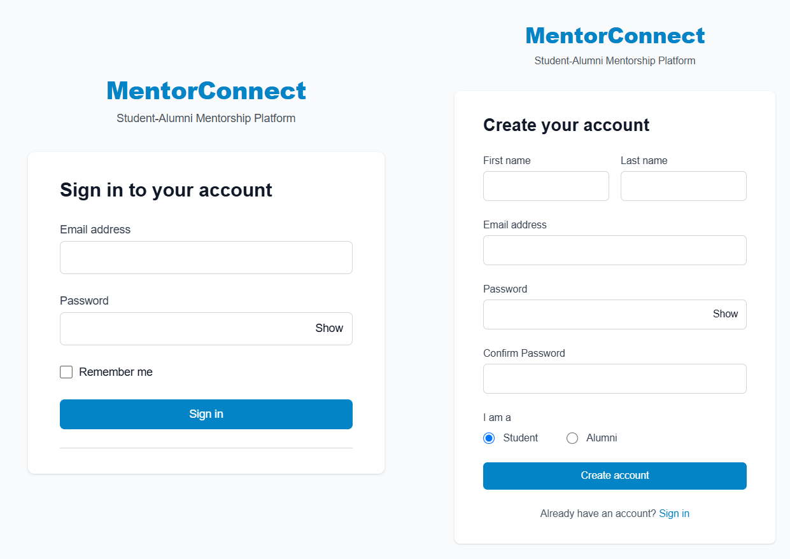
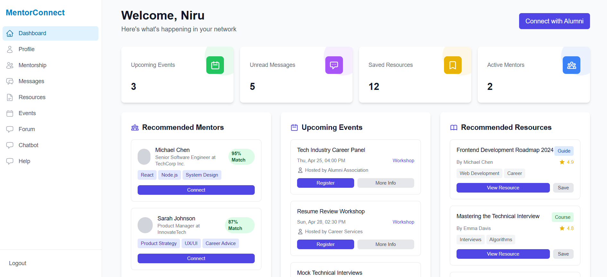

# MentorConnect: Student-Alumni Mentorship Platform

A modern web platform connecting students with alumni mentors for career guidance and professional development.


## Problem Statement

Strong mentorship connections between students and alumni play a crucial role in career growth, skill development, and academic guidance. However, traditional mentorship programs often lack structured engagement, effective communication tools, and goal-tracking mechanisms. To bridge this gap, a well-designed web platform is needed to facilitate meaningful and productive mentorship experiences.

## Our Solution Approach

MentorConnect is a fully functional web-based platform that connects students with alumni mentors based on shared interests, academic backgrounds, career aspirations, and skills. The platform provides essential tools to enhance mentorship interactions and ensure long-term engagement.

### Core Functionalities:

- **Mentor-Student Matching**: A structured system for students to find and connect with suitable mentors based on academic and career interests.
- **Interactive Communication Tools**: Built-in messaging and discussion forums for seamless mentor-student interaction.
- **Goal-Setting & Progress Tracking**: A system to define mentorship objectives, track milestones, and measure progress over time.
- **Real-time Chat & Video Calls**: Instant messaging and video conferencing for enhanced communication.
- **Session Scheduling**: Allow mentors and mentees to schedule meetings.
- **Resource Library**: A repository of useful resources for mentees.
- **Feedback & Review System**: Collect feedback from users to improve the platform.
- **Event Management**: Organize mentorship events, webinars, and workshops.
- **Admin Panel**: Manage users, mentorship requests, and platform settings.
- **MentorConnect**: stands out with a smart recommendation system, push notifications, and a gamified experience where students earn XP points,   complete mentorship quests, climb the leaderboard, and redeem credits for exclusive rewards.
## Tech Stack

- **Frontend**: React with TypeScript
- **Backend**: Node.js with Express and TypeScript
- **Database**: MongoDB
- **Authentication**: JWT with OAuth
- **UI Framework**: Tailwind CSS

## Project Structure

```
📂 Mentor_Connect-Master  
 ├── 📂 client  
 ├── 📂 server  
 ├── 📄 README.md
```
```
📂 client
├── 📂 build
│ ├── 📂 static
│ │ ├── 📄 asset-manifest.json
│ │ ├── 📄 index.html
│ │ ├── 🖼️ logo192.png
│ │ ├── 📄 manifest.json
│ │ ├── 📄 robots.txt
│ ├── 📂 public
├── 📂 src
│ ├── 📂 components
│ ├── 📂 contexts
│ ├── 📂 pages
│ ├── 📂 store
│ ├── 📂 types
│ ├── 📄 App.tsx
│ ├── 📄 index.css
│ ├── 📄 index.tsx
│ ├── 📄 reportWebVitals.ts
├── 📄 .env
├── 📄 package-lock.json
├── 📄 package.json
├── 📄 postcss.config.js
├── 📄 tailwind.config.js
├── 📄 tsconfig.json


📂 server
├── 📂 data
├── 📂 dist
├── 📂 src
│ ├── 📂 config
│ ├── 📂 controllers
│ ├── 📂 docs
│ ├── 📂 middleware
│ ├── 📂 models
│ ├── 📂 routes
│ ├── 📂 types
│ ├── 📂 utils
│ ├── 📂 views
│ ├── 📄 server.ts
├── 📄 .env
├── 📄 .env.example
├── 📄 .gitignore
├── 📄 docker-compose.yml
├── 📄 package-lock.json
├── 📄 package.json
├── 📄 prometheus-config.yml
├── 📄 tsconfig.json
├── 🖼️ Final_DFD.drawio_page-0001.jpg
├── 📄 Final_DFD.drawio.pdf
```

## Data Flow Diagram (DFD)

- [Data Flow Diagram](./Final_DFD.drawio_page-0001.jpg)


## Screenshots
[IMG01](./demo/SC01.png)

[IMG02](./demo/SC02.png)

[IMG03](./demo/SC03.png)

[IMG04](./demo/SC04.png)

[IMG05](./demo/SC05.png)

[IMG06](./demo/SC06.png)

[IMG07](./demo/SC07.png)

[IMG08](./demo/SC08.png)

[IMG09](./demo/SC09.png)

[IMG10](./demo/SC10.png)

[IMG11](./demo/SC11.jpg)

[IMG12](./demo/SC12.jpg)

[IMG13](./demo/SC13.jpg)


## Getting Started
### Prerequisites

- Node.js (v18 or higher)
- MongoDB
- npm or yarn

### Installation

1. Clone the repository:
   ```bash
   git clone https://github.com/Ashukr321/mentor_connect
   cd mentorconnect
   ```

2. Install dependencies:
   ```bash
   # Install backend dependencies
   cd server
   npm install

   # Install frontend dependencies
   cd ../client
   npm install
   ```

3. Set up environment variables:
   - Copy `.env.example` to `.env` in both client and server directories.
   - Update the variables with your configuration.

4. Start the development servers:
   ```bash
   # Start backend server
   cd server
   npm run start

   # Start frontend server
   cd client
   npm run start
   ```


## Contributors

- Ashutosh Kumar [](https://www.linkedin.com/in/ashukr321/) [](https://www.devashu.tech/) [](https://github.com/ashukr321)
- Shivam Kumar Sinha [](https://www.linkedin.com/in/shivam-kumar-sinha-55aa9b273/) [](https://github.com/Shivamkumarsinha18)
- Angel Singh [](https://www.linkedin.com/in/angel3002/) [](https://github.com/angel7544)
- Sneha Kumari [](https://www.linkedin.com/in/sneha-kumari-ss/) [](https://sneha108.vercel.app/) [](https://github.com/sneha-kumari-10)

## GitHub Repository

[Project Repository](https://github.com/your-repository/mentorconnect)

## License

This project is licensed under the MIT License - see the LICENSE file for details.

---


For further queries, contact us at [Email Me](mailto:coderashukr321@gmail.com), [Email Me](mailto:angelsingh2199@gmail.com).

